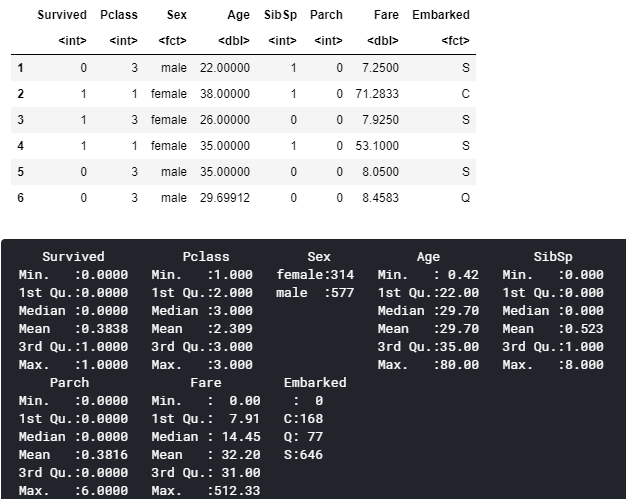

# Logistic Regression with Titanic Dataset using R

The aim of this notebook is to use every trick that I know about Logistic Regression, from data preprocessing to feature selection and so on, to achieve performance that is comparable to other more powerful algorithms such as Random Forest. 

The dataset in question is the famous [Titanic dataset](https://www.kaggle.com/c/titanic/overview). We are going to use our model to predict whether a passenger survived the accident or not.

## 1. Load the dataset and some basic preprocessing

The raw data of the first 10 rows is presented above. Immediately there are a few things we can do:
  - Remove the columns that is not necessary for our analysis: PassengerId, Name and Ticket. 
  - Deal with missing data.

There are three columns with missing data: **Cabin**, **Age** and **Embarked**, which we will use different methods of imputation to deal with. Column **Age** consists of numerical values, so **mean imputation** is sensible here since this does not change the overall mean. We simply replace any NAs with mean of non-NA entries in the same column. On the other hand, **Embarked**, denoting the port of embarkation, is a **categorical variable**, so we will impute missing values with **the most common value**, in this case is 'S'. 

Compared the above two columns, **Cabin** has too many missing values (687 missing out of 891 entries). It would be sensible to remove this column as well since any attempt to impute would lead to worse model performance.

The figure below is the table and its summary after preprocessing. It certainly looks much better after just two simple steps.

