# Logistic Regression with Titanic Dataset using R

The dataset in question in question is the famous [Titanic dataset](https://www.kaggle.com/c/titanic/overview). We are going to perform some data preprocessing/cleaning and fit a Logistic Regression model to predict whether a passenger survivied the accident or not. Information on the dataset and the meaning of each variables can be found in the hyperlink

This notebook use traditional statistical methods such as statistical tests, ANOVA table, AIC to find the correct variables for logistic regression. The link for the code can be found [here](https://www.kaggle.com/sonha264/logistic-regression-titanic-dataset) . I choose R for this notebook instead of Python since R is more powerful when it comes to statistical analysis.

## 1. Load the dataset and some basic preprocessing

Combining the train set and test set, the raw data of the first 10 rows is presented above. Immediately there are a few things we can do:
  - Remove the columns that is not necessary for our analysis: **PassengerId**, **Name** and **Ticket**. 
  - Deal with missing data. We will discuss this in details in the section below.
  
### 1.1. Dealing with missing data

There are 4 columns with missing data: **Age**,**Fare**,**Cabin**,**Embarked**. **Cabin** has 1014 missing values in a total of 1309 data points. We remove this column because it is so sparse. **Embarked** is a categorical variable with 2 missing value, hence we impute with the most common value 'S'. **Fare**, on the other hand, is a numerical variable with one missing value, which we impute using the mean of the entire column to preserve the mean after imputation.

**Age** is a numerical value as well. But if we apply mean imputation we can see the distribution of Age changes drastically. This is because of higher number of missing values compared to **Fare**.

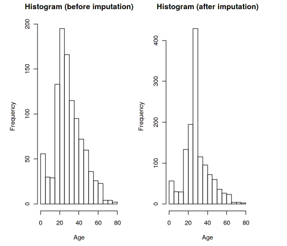

Let's try another imputation method: Multivariate Imputation by Chained Equation ([MICE](https://cran.r-project.org/web/packages/mice/mice.pdf)). MICE assumes that the data is Missing At Random, meaning the probability of missing data of a variable is dependent on the other variables. Hence, say if we have variables X1,X2,...Xn, and X1 is the missing value, we can predict what X1 is using a model trained on X2,..,Xn. 

Imputing **Age** with MICE results in almost the same distribution of Age, which is a much better result.

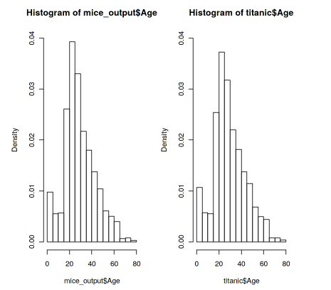

## 2.Exploratory Analysis

  
  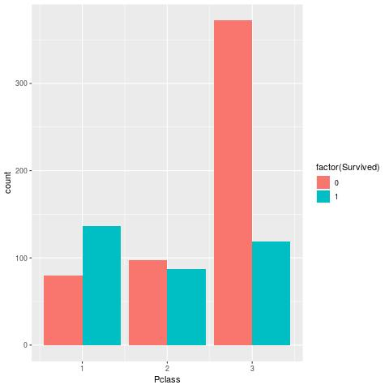 
  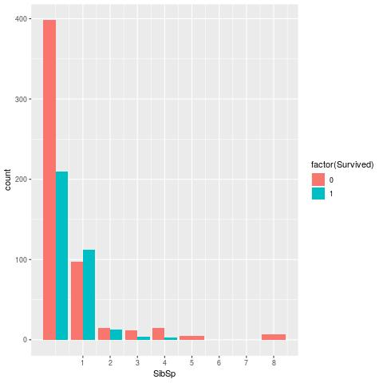 

  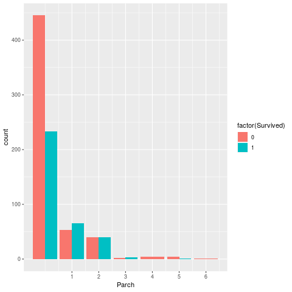
  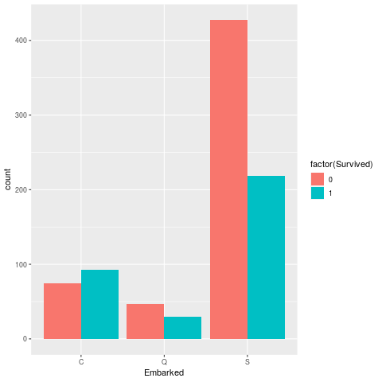 

  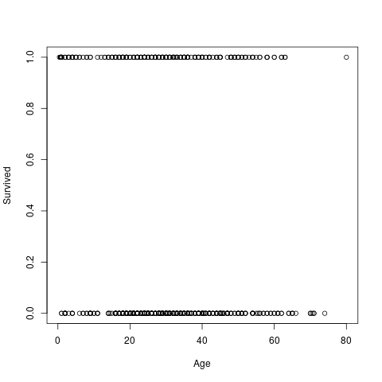
  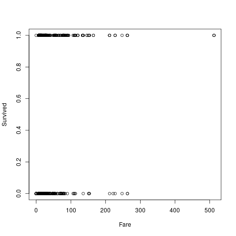 

The first 5 bar charts are counts of survivors and non-survivors with respect to **Sex**, **Pclass**,**SibSp**,**Parch** and **Embarked**. The last two are scatterplots of Survival against Age and Fare. We can observe that women, higher class ticket owners and those embarked from Cherbourg and Southhampton were more likely to survive. Ticket fare does not seem not say much about survival probability. Lastly, those with only one Parent/Children or Sibling/Spouse were less likely to survive. We create another variable **SibSp_1** and **Parch_1** equals to 1 if **SibSp**,**Parch** = 1 and 0 otherwise. 

We can try to feature engineer another variable 'Family Size' ( idea borrowed from this [this fantastic notebook](https://www.kaggle.com/mrisdal/exploring-survival-on-the-titanic/)), which is calculated by: **FullSize** = 1 + **SibSp** + **Parch**. Plotting the bar chart reveals an interesting pattern: family with size 2, 3, 4 were more likely to survive than other family size (either singleton or more than 4). To better reflect this observation, we set family size variable **Fsize** = 'medium' if family has size 2, 3, 4, 'single' if family group only has one member, and 'large' if family has size more than 4.

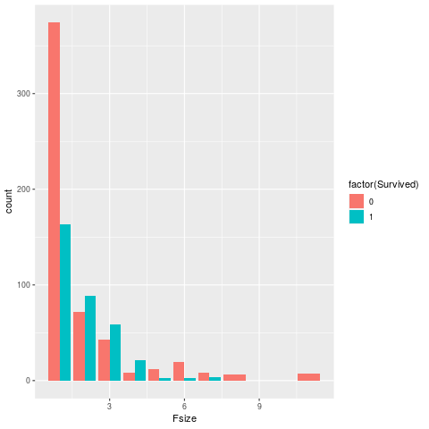

We end up with the below table ready for model fitting and prediction.

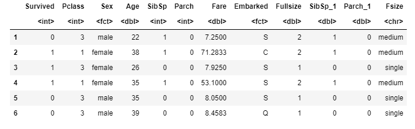

## 3. Model Fitting and Variable Selection

Machine Learning approach aims to find the parameters to minimise an Objective function. On the other hand Statistical approach finds the parameters to maximise the likelihood function. Mathematically when it comes to Logistic Regression, both approaches are very much the same, since minimising the empirical risk associated with the log loss (ML objective) is equivalent to maximising the Likelihood function (Statistical method objective). For this notebook I will perform model selection using statistical methods in R.

At first fitting Logistic Regression using all variables as explanatory variables to predict **Survived**, we obtain 2 tables below, one is the summary table, and the other is the Analysis of Deviance table: 

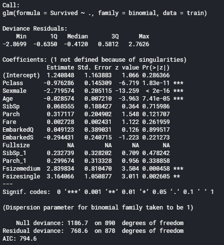
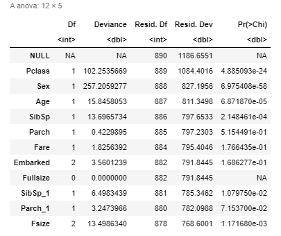

There are a lot of information we can unpack here! In the summary table (left table), the first column is estimate for our parameters. The last column 'P(>|z|)' of the same table is the p-value for the hypothesis test that the parameter is 0 (we call this test the Wald test). According to the Wald test, only **Pclass**, **Sex**, **Age** and **Fsize** are significant variables that we want to keep in our model at 5% significance level.

The second table is the ANOVA table. The idea is that we read the table from top to bottom. Starting with a model with only the intercept, each time we arrive at a row the p-value for adding that row's variable into our model is calculated. Then we add that variable into our model and repeat the process with the next row. The last column consists of those p-values, and as we can see the addition of **Pclass**, **Sex**, **Age**, **SibSp**, **SibSp_1**, **Parch_1** and **F_size** are all significant according to the ANOVA table.

Let's use another metric to really make sure what variable we want to include in our final model: Akaike Information Criterion (AIC). AIC is a popular and powerful metric to compare between models because it not only rewards goodness of fit of the model, but it also penalises overfitting. AIC can be read at the bottom of the summary table, and model with lower AIC tends to be favoured. R has a function 'stepAIC' that manually searches through all combinations of the variables and find which combination leads to the lowest AIC. through that we obtain **Survived** ~ **Pclass** + **Sex** + **Age** + **Fsize** + **Parch** as the model with the lowest AIC. 

That sounds fairly consistent with our exploratory analysis, the Wald test and the ANOVA table. Fitting the logitic reression again with only these variables obtained through 'stepAIC' we obtain the following tables:

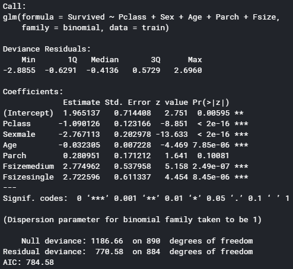
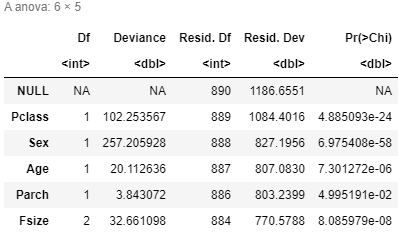

This model has the lowest AIC, and the ANOVA table shows the addition of all of the chosen variables are significant. The p-values of the Wald test also suggests all variables are significant EXCEPT for **parch**. Still I think the inclusion of **parch** is necessary because we follow the result of AIC and the ANOVA table. Most of the time the Wald test only acts as a guideline and is not as definitive as AIC or ANOVA table can be. In fact, young and Smith (2005) write: “There is no clear-cut theory to establish which procedure is best, but there is a substantial body of literature pointing towards the conclusion that […] the likelihood ratio procedure (ANOVA) has the best agreement between the true and asymptotic distributions.”

In this section we have performed variable selection based on a variety of criteria: AIC, ANOVA table and Wald test. There are a lot more metrics available such as r-squared score, BIC, ... but I am happy with what we have chosen to work with. It is crucial to remember none of the criteria offers a definitive answer on which variable should be included in our model. As a result, it is good practice to use more than one methods when it comes to variable selection.

## 4. Predict survival of passengers

The rest of the task is straightforward, given a test set we use our model to predict the survival. Predicting using the dataset on Kaggle gives a score of 77.3% correct answers, which is a fairly good score for Logistic Regression model.

So how can we improve from here? An obvious way is to use more powerful models. Tree-based model such as Random Forests and boosting algorithm such as Gradient Boosting are currently state-of-the-art predictive model. Their flexibility and sheer number of parameters help them outperform Logistic Regression almost always. But if you want to squeeze some extra percentage out of our Logisitic Model, there are still some more minor improvements we can do: Feature Engineering more features (especially from **Name** and **Ticket**), using regularisation, etc. 

## 5. Conclusion 

We have performed a thorough statistical analysis of the titanic dataset and predicted survival of passengers. Thanks to our good methods of feature engineering and variable selction we performed fairly well with a simple model like Logistic Regression.
